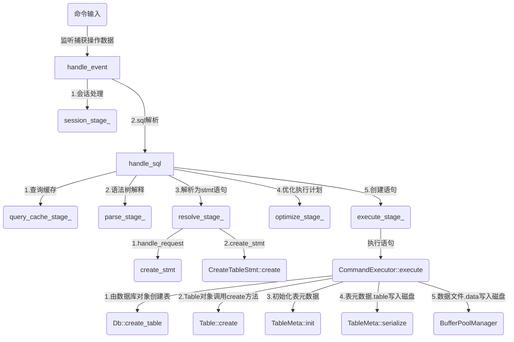
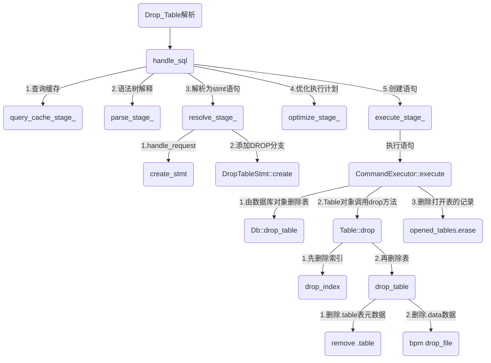
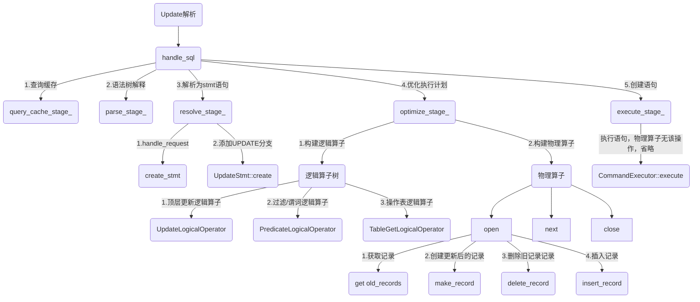

# 启动server
./build_debug/bin/observer -f ./etc/observer.ini -P cli

# miniob解析流程分析
1. **事件会话流程**
- **PATH**: `/root/miniob/src/observer/net/sql_task_handler.cpp`
  - `handle_event`监听捕获来自上层的操作数据 -> `read_event`解析数据为`SessionEvent`类型的对象 -> `session_stage_`会话处理 -> 创建新`SQLStageEvent`对象，`handle_sql`进行sql解析操作: `query_cache_stage_`查询缓存 -> `parse_stage_`语法树解释 -> `resolve_stage_`解析为stmt语句 -> `optimize_stage_`优化执行计划 -> `execute_stage_`执行阶段
  - *create\drop主要关注stmt语法解析和executor执行阶段*

2. **stmt语法解析**
- **PATH**: `/root/miniob/src/observer/sql/stmt/stmt.cpp`
  - `resolve_stage_.handle_request` -> `Stmt::create_stmt`选择需要创建的stmt语句类型，`CreateTableStmt::create`创建语句

3. **executor执行**
- **PATH**: `/root/miniob/src/observer/sql/executor/execute_stage.cpp`
  - 对象`SQLStageEvent`中包含了各个阶段的解析结果，包括`session_event_`注册的事件、`sql_`需处理的sql语句、`sql_node_`解析后的sql命令、`stmt_`进一步处理的sql数据结构、`operator_`执行计划
  - 进入`CommandExecutor::execute`函数，判断执行sql指令类型。
  - 假设进入`CREATE_TABLE`分支，`CreateTableExecutor::execute`执行对应建表指令
  - `CreateTableExecutor::execute`获取事件信息，由事件的数据库Db对象执行建表语句`session->get_current_db()->create_table`
  - 最终执行函数位于`/root/miniob/src/observer/storage/db/db.cpp`

4. **create_table样例分析**
- **PATH**: `/root/miniob/src/observer/storage/db/db.cpp`
  - **create_table**
    1. 创建一个`Table`对象，调用`Table::create`方法
    2. 对传入参数进行验证，并检验表的唯一性
    3. `Table.table_meta_`属性用于记录表的名称、属性各类信息，使用`table_meta_.init`初始化创建表的信息
    4. 创建`fstream`对象创建表元数据文件，由`table_meta_.serialize`方法将表元数据.table写入物理磁盘
    5. 之后由数据库的`BufferPoolManager`将表数据文件.data写入物理磁盘，并使用对应引擎打开表，存储到缓冲区



# drop实现
## 实现过程
- `handle_sql`进行sql解析操作: `query_cache_stage_`查询缓存 -> `parse_stage_`语法树解释 -> `resolve_stage_`解析为stmt语句 -> `optimize_stage_`优化执行计划 -> `execute_stage_`执行阶段
1. **stmt解析**
  - 首先在`resolve_stage_`中解析drop table的stmt语句: `resolve_stage_.handle_request` -> `Stmt::create_stmt`
  - 添加`SCF_DROP_INDEX`与`SCF_DROP_TABLE`分支，基于`parse_stage_`语法树解析结果`DropIndexSqlNode`与`DropTableSqlNode`创建`DropIndexStmt`与`DropTableStmt`类。
  - `RC`中添加`SCHEMA_INDEX_NOT_EXIST`参数表示index索引不存在
  - `DropIndexStmt`包含表`table`对象和`index_name_`索引
  - `DropTableStmt`只含有`table_name_`属性
2. **excecute执行指令**
  - 由`execute_stage_.handle_request`创建对象，执行`CommandExecutor.execute`操作解析drop table命令
  - 添加`DROP_INDEX`与`DROP_TABLE`分支，同时新建`DropIndexExecutor`与`DropTableExecutor`类
  
  - **DROP_INDEX**
  - `DropIndexExecutor.execute`获取对应事件管理器`Trx`和表`Table`，由`Table->drop_index`表对象执行索引删除
  - `Table::drop_index`接收表名称调用数据库引擎`engine_->drop_index`执行索引删除
  - 在数据库引擎基类`TableEngine`与当前两种引擎`HeapTableEngine`和`LsmTableEngine`中添加`drop_index`函数。`LsmTableEngine`引擎暂未实现，抛出`UNIMPLEMENT`异常
  - 删除索引文件，先关闭后删除`BplusTreeIndex::close` - `BplusTreeHandler::close` - `BufferPoolManager::close_file` -> `BplusTreeIndex::drop` - `BufferPoolManager::drop_file`
  - 删除表元数据中对应索引，在`TableMeta::drop_index`中根据索引名称找到索引并删除
  - 创建一份表元数据的临时文件写入修改后重命名覆盖原磁盘中的元数据文件，同时使用`TableMeta::swap`覆写内存中的元数据

  - **DROP_TABLE**
  - `DropTableExecutor.execute`将`table_name_`属性传递给事件的数据库Db对象`session->get_current_db()->drop_table`，由数据库执行表删除
  - `Db::drop_table`接收表名称，检查表是否存在，并获取表路径、名称、id等信息。创建调用`table->drop`方法，结束后在`opened_tables_`中删除对应表名
  - `Table::drop`: 1.检查表是否存在 2.`remove(path)`删除表元数据文件 3.`BufferPoolManager::drop_file`删除表数据文件

## 流程图


## drop文件结构
```js
\---src
  +---common
  |   \---sys
  |       \---rc.h::[54]
  \---observer
      +---sql
      |   +---executor
      |   |   +---command_executor.cpp::[21-22|47-56]
      |   |   |---drop_index_executor.cpp::[0]
      |   |   |---drop_index_executor.h::[0]
      |   |   |---drop_table_executor.cpp::[0]
      |   |   \---drop_table_executor.h::[0]
      |   \---stmt
      |       +---drop_index_stmt.cpp::[0]
      |       |---drop_index_stmt.h::[0]
      |       |---drop_table_stmt.cpp::[0]
      |       |---drop_table_stmt.h::[0]
      |       \---stmt.cpp::[21-22|77-84]
      \---storage
          +---buffer
          |   +---disk_buffer_pool.cpp::[840-860]
          |   \---disk_buffer_pool.h::[330]
          +---db
          |   +---db.cpp::[173-197]
          |   \---db.h::[72-77]
          +---index
          |   +---bplus_tree_index.cpp::[46-67]
          |   \---bplus_tree_index.h::[31]
          \---table
              +---heap_table_engine.cpp::[210-295]
              |---heap_table_engine.h::[34]
              |---lsm_table_engine.h::[36]
              |---table_engine.h::[45]
              |---table_meta.cpp::[110-122]
              |---table_meta.h::[42]
              |---table.cpp::[130-183|319-323]
              \---table.h::[62-69|97]
```

## 测试运行结果
- Successfully load /root/miniob/etc/observer.ini
- miniob > `show tables`
- `Tables_in_SYS`

- miniob > `create table test(id int)`
- `SUCCESS`

- miniob > `show tables`
- `Tables_in_SYS`
- `test`

- miniob > `drop table test`
- `SUCCESS`

- miniob > `show tables`
- `Tables_in_SYS`

- miniob > `drop table test`
- `FAILURE`

```log
[2025-05-13 14:39:39.721195 pid:6064 tid:7ffff72b17c0 ctx:0 INFO: init@init.cpp:215] >> Successfully init utility
[2025-05-13 14:39:48.745361 DEBUG: yylex@lex_sql.l:95] >> SHOW
[2025-05-13 14:39:48.745599 DEBUG: yylex@lex_sql.l:92] >> TABLES
[2025-05-13 14:39:48.758539 INFO: handle_event@sql_task_handler.cpp:46] >> write result return SUCCESS
[03.635517 DEBUG: yylex@lex_sql.l:89] >> CREATE
[03.635823 DEBUG: yylex@lex_sql.l:91] >> TABLE
[03.635987 DEBUG: yylex@lex_sql.l:125] >> ID
[03.636144 DEBUG: yylex@lex_sql.l:126] >> LBRACE
[03.636294 DEBUG: yylex@lex_sql.l:125] >> ID
[03.636497 DEBUG: yylex@lex_sql.l:111] >> INT_T
[03.636682 DEBUG: yylex@lex_sql.l:127] >> RBRACE
[03.636902 DEBUG: sql_debug@sql_debug.cpp:51] >> 'sql debug info: [create table statement: table name test]'
[03.637307 INFO: create@table.cpp:54] >> 'Begin to create table miniob/db/sys:test'
[03.641016 INFO: init@field_meta.cpp:57] >> 'Init a field with name=id'
[03.641348 INFO: init@table_meta.cpp:101] >> 'Sussessfully initialized table meta. table id=0, name=test'
[03.650912 INFO: create_file@disk_buffer_pool.cpp:837] >> 'Successfully create miniob/db/sys/test.data.'
[03.651884 INFO: open_file@disk_buffer_pool.cpp:236] >> 'Successfully open buffer pool file miniob/db/sys/test.data.'
[03.652267 DEBUG: lock@mutex.cpp:266] >> debug lock 0x7ffff42fc828, lbt=0x4d1e0 0x572992 0x552f01 0xdfec7 0xda47f 0x7d9cb 0x9b5b4 0x829a9 0xa59ff 0x374988 0x375f70 0x196fbb 0xec747 0x229a71 0x223d50 0x34d05 0x2da01 0x2a608 0x27d5b 0xa0bd 0x21ca 0x228b 0x6ee5
[03.655569 TRACE: pin@frame.cpp:218] >> after frame pin. this=0x7ffff42fa808, write locker=0, read locker has xid 0? pin=1, frameId=buffer_pool_id:1,page_num:0, xid=504000000150, lbt=0x4d1e0 0x572992 0xdabb9 0x7d9cb 0x9b5b4 0x829a9 0xa59ff 0x374988 0x375f70 0x196fbb 0xec747 0x229a71 0x223d50 0x34d05 0x2da01 0x2a608 0x27d5b 0xa0bd 0x21ca 0x228b 0x6ee5
[03.655884 DEBUG: unlock@mutex.cpp:273] >> debug unlock 0x7ffff42fc828, lbt=0x4d1e0 0x572992 0x553793 0xdff0a 0xdae66 0x7d9cb 0x9b5b4 0x829a9 0xa59ff 0x374988 0x375f70 0x196fbb 0xec747 0x229a71 0x223d50 0x34d05 0x2da01 0x2a608 0x27d5b 0xa0bd 0x21ca 0x228b 0x6ee5
[03.656079 DEBUG: alloc@disk_buffer_pool.cpp:142] >> allocate a new frame. frame=frame id:buffer_pool_id:1,page_num:0, dirty=0, pin=1, lsn=-4702111234474983746, this=0x7ffff42fa808
[03.656344 DEBUG: allocate_frame@disk_buffer_pool.cpp:712] >> allocate frame 0x7ffff42fa808, page num 0, frame=frame id:buffer_pool_id:1,page_num:0, dirty=0, pin=1, lsn=-4702111234474983746, this=0x7ffff42fa808
[03.656820 DEBUG: load_page@disk_buffer_pool.cpp:760] >> Load page miniob/db/sys/test.data:0, file_desc:5, frame=frame id:buffer_pool_id:1,page_num:0, dirty=0, pin=1, lsn=0, this=0x7ffff42fa808
[03.657263 INFO: open_file@disk_buffer_pool.cpp:274] >> Successfully open miniob/db/sys/test.data. file_desc=5, hdr_frame=0x7ffff42fa808, file header=pageCount:1, allocatedCount:1
[03.657551 DEBUG: open_file@disk_buffer_pool.cpp:886] >> insert buffer pool into fd buffer pools. fd=5, bp=0x50e000001700, lbt=0x4d1e0 0x572992 0xa6d11 0x374988 0x375f70 0x196fbb 0xec747 0x229a71 0x223d50 0x34d05 0x2da01 0x2a608 0x27d5b 0xa0bd 0x21ca 0x228b 0x6ee5
[03.657901 INFO: init_free_pages@record_manager.cpp:538] >> record file handler init free pages done. free page num=0, rc=SUCCESS
[03.658108 INFO: init@record_manager.cpp:497] >> open record file handle done. rc=SUCCESS
[03.658295 INFO: create@table.cpp:127] >> 'Successfully create table miniob/db/sys:test'
[03.658463 INFO: create_table@db.cpp:170] >> 'Create table success. table name=test, table_id:0'
[03.658630 DEBUG: lock@mutex.cpp:266] >> debug lock 0x7ffff42fc828, lbt=0x4d1e0 0x572992 0x552f01 0xdfec7 0xda47f 0x7fcae 0xaa6e7 0xaa246 0xa9d02 0xb56df 0xafff6 0x7fec3 0x93df5 0x373a3b 0x1a26fe 0xf38c2 0x224ad8 0x34d05 0x2da01 0x2a608 0x27d5b 0xa0bd 0x21ca 0x228b 0x6ee5
[03.658799 TRACE: pin@frame.cpp:218] >> after frame pin. this=0x7ffff42fa808, write locker=0, read locker has xid 0? pin=2, frameId=buffer_pool_id:1,page_num:0, xid=504000000150, lbt=0x4d1e0 0x572992 0xdabb9 0x7fcae 0xaa6e7 0xaa246 0xa9d02 0xb56df 0xafff6 0x7fec3 0x93df5 0x373a3b 0x1a26fe 0xf38c2 0x224ad8 0x34d05 0x2da01 0x2a608 0x27d5b 0xa0bd 0x21ca 0x228b 0x6ee5
[03.658979 DEBUG: unlock@mutex.cpp:273] >> debug unlock 0x7ffff42fc828, lbt=0x4d1e0 0x572992 0x553793 0xdff0a 0xdae66 0x7fcae 0xaa6e7 0xaa246 0xa9d02 0xb56df 0xafff6 0x7fec3 0x93df5 0x373a3b 0x1a26fe 0xf38c2 0x224ad8 0x34d05 0x2da01 0x2a608 0x27d5b 0xa0bd 0x21ca 0x228b 0x6ee5
[03.659366 TRACE: add_page@double_write_buffer.cpp:110] >> insert page into double write buffer. buffer_pool_id:1,page_num:0,lsn=0, dwb size:1
[03.659842 DEBUG: flush_page_internal@disk_buffer_pool.cpp:564] >> Flush block. file desc=5, frame=frame id:buffer_pool_id:1,page_num:0, dirty=0, pin=2, lsn=0, this=0x7ffff42fa808
[03.660033 DEBUG: lock@mutex.cpp:266] >> debug lock 0x7ffff42fc828, lbt=0x4d1e0 0x572992 0x552f01 0xdfec7 0xdc6bc 0x93ee3 0x373a3b 0x1a26fe 0xf38c2 0x224ad8 0x34d05 0x2da01 0x2a608 0x27d5b 0xa0bd 0x21ca 0x228b 0x6ee5
[03.660206 TRACE: unpin@frame.cpp:236] >> after frame unpin. this=0x7ffff42fa808, write locker=0, read locker has xid? 0, pin=1, frameId=buffer_pool_id:1,page_num:0, xid=504000000150, lbt=0x4d1e0 0x572992 0xdce40 0x93ee3 0x373a3b 0x1a26fe 0xf38c2 0x224ad8 0x34d05 0x2da01 0x2a608 0x27d5b 0xa0bd 0x21ca 0x228b 0x6ee5
[03.660384 DEBUG: unlock@mutex.cpp:273] >> debug unlock 0x7ffff42fc828, lbt=0x4d1e0 0x572992 0x553793 0xdff0a 0xdf32d 0x93ee3 0x373a3b 0x1a26fe 0xf38c2 0x224ad8 0x34d05 0x2da01 0x2a608 0x27d5b 0xa0bd 0x21ca 0x228b 0x6ee5
[03.660548 INFO: sync@heap_table_engine.cpp:339] >> Sync table over. table=test
[03.660707 INFO: sync@db.cpp:277] >> Successfully sync table db:sys, table:test.
[03.668275 TRACE: write_page@double_write_buffer.cpp:173] >> double write buffer write page. buffer_pool_id:1,page_num:0,lsn=0
[03.668734 TRACE: write_page@disk_buffer_pool.cpp:613] >> write_page: buffer_pool_id:1, page_num:0, lsn=0, check_sum=-1373569955
[03.669584 INFO: sync@db.cpp:282] >> double write buffer flush pages ret=SUCCESS
[03.674177 INFO: flush_meta@db.cpp:415] >> Successfully write db meta file. db=sys, file=miniob/db/sys/sys.db.tmp, check_point_lsn=0
[03.674427 INFO: sync@db.cpp:301] >> Successfully sync db. db=sys
[03.674710 INFO: execute@command_executor.cpp:112] >> sync db after ddl. rc=0
[03.675088 INFO: handle_event@sql_task_handler.cpp:46] >> 'write result return SUCCESS'
[06.569517 DEBUG: yylex@lex_sql.l:95] >> SHOW
[06.569996 DEBUG: yylex@lex_sql.l:92] >> TABLES
[06.570705 INFO: handle_event@sql_task_handler.cpp:46] >> 'write result return SUCCESS'
[14.506097 DEBUG: yylex@lex_sql.l:90] >> DROP
[14.506756 DEBUG: yylex@lex_sql.l:91] >> TABLE
[14.507100 DEBUG: yylex@lex_sql.l:125] >> ID
[14.507709 DEBUG: sql_debug@sql_debug.cpp:51] >> 'sql debug info: [drop table statement: table name test]'
[14.508375 INFO: drop@table.cpp:145] >> 'Begin to drop table miniob/db/sys:test'
[14.511640 INFO: drop@table.cpp:164] >> 'Successfuly remove .table table-meta file for drop. file name=miniob/db/sys/test.table'
[14.513243 INFO: drop_file@disk_buffer_pool.cpp:853] >> 'Successfuly remove file in buffer drop. file name=miniob/db/sys/test.data'
[14.513451 INFO: drop@table.cpp:181] >> 'Successfully drop table miniob/db/sys:test'
[14.513648 INFO: drop_table@db.cpp:195] >> 'Drop table success. table name=test, table_id:0'
[14.519261 INFO: sync@db.cpp:282] >> double write buffer flush pages ret=SUCCESS
[14.522615 INFO: flush_meta@db.cpp:415] >> 'Successfully write db meta file. db=sys, file=miniob/db/sys/sys.db.tmp, check_point_lsn=0'
[14.523005 INFO: sync@db.cpp:301] >> Successfully sync db. db=sys
[14.523248 INFO: execute@command_executor.cpp:112] >> sync db after ddl. rc=0
[14.523655 INFO: handle_event@sql_task_handler.cpp:46] >> 'write result return SUCCESS'
[16.947409 DEBUG: yylex@lex_sql.l:95] >> SHOW
[16.947807 DEBUG: yylex@lex_sql.l:92] >> TABLES
[16.948234 INFO: handle_event@sql_task_handler.cpp:46] >> 'write result return SUCCESS'
[22.327750 DEBUG: yylex@lex_sql.l:90] >> DROP
[22.328410 DEBUG: yylex@lex_sql.l:91] >> TABLE
[22.329251 DEBUG: yylex@lex_sql.l:125] >> ID
[22.329619 DEBUG: sql_debug@sql_debug.cpp:51] >> 'sql debug info: [drop table statement: table name test]'
[22.330097 WARN: drop_table@db.cpp:179] >> 'test has not been opened before.'
[22.330440 TRACE: handle_sql@sql_task_handler.cpp:86] >> 'failed to do execute. rc=SCHEMA_TABLE_NOT_EXIST'
[22.330787 TRACE: handle_event@sql_task_handler.cpp:39] >> 'failed to handle sql. rc=SCHEMA_TABLE_NOT_EXIST'
[22.331165 INFO: handle_event@sql_task_handler.cpp:46] >> 'write result return SUCCESS'
```

# update实现
## SQL执行原理
1. **事件会话流程**
- **PATH**: `/root/miniob/src/observer/net/sql_task_handler.cpp`
  - `handle_event`监听捕获来自上层的操作数据 -> `read_event`解析数据为`SessionEvent`类型的对象 -> `session_stage_`会话处理 -> 创建新`SQLStageEvent`对象，`handle_sql`进行sql解析操作: `query_cache_stage_`查询缓存 -> `parse_stage_`语法树解释 -> `resolve_stage_`解析为stmt语句 -> `optimize_stage_`优化执行计划 -> `execute_stage_`执行阶段
  - *update主要关注stmt语法解析、optimize优化和execute执行阶段*

2. **stmt语法解析**
- **PATH**: `/root/miniob/src/observer/sql/stmt/stmt.cpp`
  - `resolve_stage_.handle_request` -> `Stmt::create_stmt`选择需要创建的stmt语句类型，`UpdateStmt::create()`创建语句

3. **optimize优化**
- **PATH**: `/root/miniob/src/observer/sql/optimizer/optimizer_stage.cpp`
  - 创建`LogicalOperator`逻辑算子对象，创建逻辑算子计划。
  - `LogicalPlanGenerator::create()`方法选择创建的类型，以delete为例。接受`DeleteStmt`，记录表对象和过滤条件，创建如下关系的算子`delete_operator` -> `predicate_operator` -> `table_get_operator`。代表从顶层开始依次向下获取信息，并在更改后返回。
  - 创建`PhysicalOperator`物理算子对象，创建物理算子计划。
  - `PhysicalPlanGenerator::create()`方法选择创建的类型。接受`LogicalOperator`，构建子算子关系后实例化`DeletePhysicalOperator`等各类逻辑算子对应的操作。
  - 物理算子包含了实际执行的操作，使用`open()`、`next()`、`close()`的模式依次进行调用。

4. **executor执行**
- **PATH**: `/root/miniob/src/observer/sql/executor/execute_stage.cpp`
  - 使用优化器定义了物理操作的对象将由`ExecuteStage::handle_request_with_physical_operator()`方法获取，此时并未观察到实际执行操作。即物理算子的操作不会在执行器阶段实际执行，而是在事件返回结果时由`write_result()`依序执行。
  
## 实现过程
1. **stmt解析**
- `UpdateStmt`类已经实现，包含属性`table_`更新的表对象, `values_`更新的值, `value_amount_`更新值的数量, `field_`更新的字段, `filter_`条件过滤。
- `UpdateStmt::create()`方法。首先检查数据合法性，包括表对象是否存在、更新的字段是否存在、类型是否匹配，然后构建过滤器。
2. **optimize实现**
- `OptimizeStage::handle_request()` -> `OptimizeStage::create_logical_plan()` -> `OptimizeStage::generate_physical_plan()`
  - **逻辑算子构建**
  - `LogicalPlanGenerator::create()` -> `create_plan(UpdateStmt)`
  - 结合insert与delete方法实现update的逻辑算子生成，算子调用顺序`update_operator` -> `predicate_operator` -> `table_get_operator`
  - 创建`update_logical_operator`文件实现逻辑算子`UpdateLogicalOperator`类，具有属性`table_`、`field_id_`、`value_`。添加逻辑算子类型`LogicalOperatorType::UPDATE`

  - **物理算子构建**
  - `PhysicalPlanGenerator::create()` -> `create_plan(static_cast<UpdateLogicalOperator &>)`
  - 结合delete方法实现update的物理算子生成。此时物理算子已经生成完毕，但实际算子的执行操作会在excute阶段之后，写回结果之前。
  - 创建`update_physical_operator`文件实现物理算子`UpdatePhysicalOperator`类，具有属性`table_`、`field_id_`、`value_`、`trx_`。添加物理算子类型`PhysicalOperatorType::UPDATE`
  - `UpdatePhysicalOperator::open()`实现
    1. 首先从子算子获取记录`Record`
    2. 生成新的记录。依次检查记录的字段，对应update的更新字段则使用更新的值覆盖，其余进行拷贝
    3. 记录待删除的记录
    4. 记录调取完毕后再统一进行删除和插入操作
## 流程图


## update文件结构
```js
\---src
  \---observer
      \---sql
          +---operator
          |   +---logical_operator.h::[43]
          |   |---physical_operator.h::[56]
          |   |---update_logical_operator.cpp::[0]
          |   |---update_logical_operator.h::[0]
          |   |---update_physical_operator.cpp::[0]
          |   \---update_physical_operator.h::[0]
          +---operator
          |   +---logical_plan_gencerator.cpp::[23|37|67-42|246-273]
          |   |---logical_plan_gencerator.h::[26|44]
          |   |---physical_plan_gencerator.cpp::[46-47|92-95|261-286]
          |   \---physical_plan_gencerator.h::[26|54]
          \---stmt
              +---stmt.cpp::[35|60-62]
              |---update_stmt.cpp::[0]
              \---update_stmt.h::[0]
```

## 测试运行结果
- **测试样例预设**
- `create table t1(id int, name int)`
- `insert into t1 values(1, 101)`    `insert into t1 values(2, 202)`    `insert into t1 values(3, 303)`
Successfully load /root/miniob/etc/observer.ini
miniob > select * from t1
id | name
1 | 101
2 | 202
3 | 303

miniob > update t1 set name=404 where id=3
SUCCESS

miniob > select * from t1
id | name
1 | 101
2 | 202
3 | 404

miniob > update t1 set name=505
SUCCESS

miniob > select * from t1
id | name
1 | 505
2 | 505
3 | 505